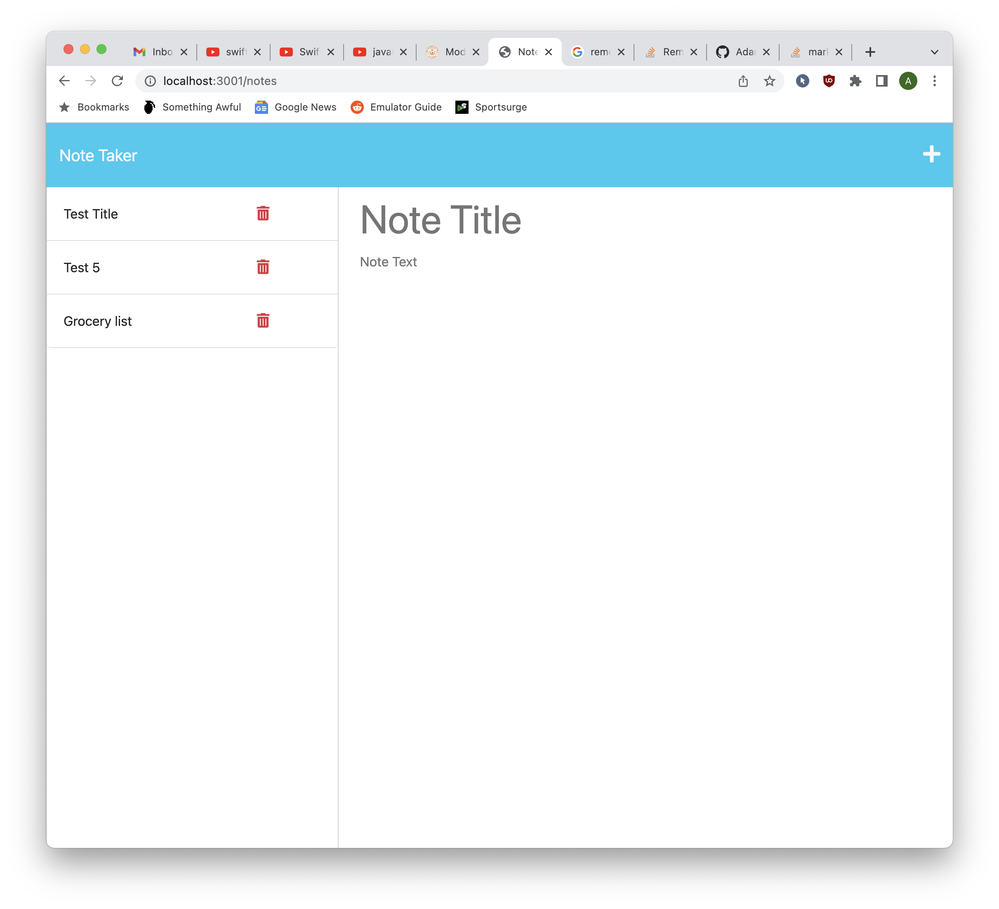

# Express js Note Taker  

## Description
This project is a note taking tool that can keep track of notes, delete notes and post new ones.
## Table of Contents:
* [Installation](#installation)
* [Usage](#usage)
* [License](#license)
* [Contributing](#contributing)
* [Tests](#tests)
* [Questions](#questions)
### Installation:
This project uses the following dependencies:
```clone the git repo and run npm i to download any dependencies and then run npm start to start the server.```
### Usage:
Project can be used for personal use only.
### Screenshot: 

### License:
This project is licensed under:
MIT License
### Contributing:
Project is open source and can be used however.
### Tests:
In order to test open the console and run the following:
```N/A```
### Questions:
If you have any questions contact me on [GitHub](https://github.com/adam42288) or email 
me at a75052@gmail.com  
 